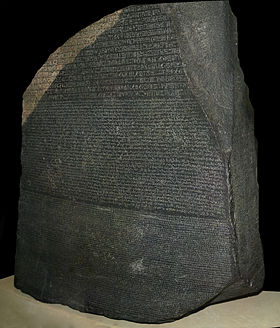

# Start testing your python notebooks

## TL;DR : boar helps test notebooks in CI pipelines

[https://github.com/alexandreCameron/boar](https://github.com/alexandreCameron/boar)

[https://pypi.org/project/boar/](https://pypi.org/project/boar/)

It provides functions to:

* test: check that a notebook can be executed until its last cell
* lint: check that a notebook does not have output secretly stored in a cell
* run: execute a notebook and collect the output

## Uncertainty of ML projects

<!-- https://ftw.usatoday.com/2015/12/5-most-memorable-hail-marys-in-nfl-history -->

I had been working on the PoC for the end of the past sprint.
I was still not sure I would get any results for this model.
I had tried different feature constructions, data splits and classifiers.
Two weeks had gone by since the sprint planning.
After half a dozen stand-up meetings spent on the same task,
I would have to tell Scott my boss that I was not sure the problem could have a simple solution.
Even though Scott understands agile methodology, he would not be amused.
Wait! What about this unconventional idea I had a week ago? I still had one day to throw a Hail Mary pass.
A bit discouraged by my previous failed attempts, but sill eager to try,
I opened my notebook and started frenetically pouring lines of code in the cells.

[A Hail Mary pass is a desperate last attempt long forward pass to win a US football game [wikipedia](https://en.wikipedia.org/wiki/Hail_Mary_pass)]

## Deciphering notebooks

<!-- https://en.wikipedia.org/wiki/Rosetta_Stone -->

What happens next to the model is of little importance.
What is more interesting is how to handle the notebook where “lines of codes were written frenetically”.
What are the options?

* Was the idea of any interest? Should it just be deleted?
* Could it be useful? Should it be “archived”?
* Is it the start of something big? Should it be converted in a tested production-grade code?

[Disclaimer: I’m not advocating to keep dead code.
Dead code should be eradicated without any remorse otherwise zombie bugs might come to viciously haunt the project.]

There are probably other options.
But, in practice, Scott will have to deliver his promise to the customer and he will push the task until the job is done.
If a task is listed on the sprint board, the cold hard truth is that the team will have to solve the issue.
In short, I will have to decipher the notebook and integrate the useful part to a production-grade software.
When this inevitably happens, my future-self will curse a lot against my past-self.
My future-self will regret not having a reproducible code on a different machine,
basics tests and tutorials to document what is happening.

## TDD on uncharted territory

<!-- https://www.smithsonianmag.com/history/even-1784-america-it-was-impossible-make-map-without-infuriating-someone-180952700/ -->

Some colleagues with a solid software development background may point out that best practice would suggest to use TDD.
At the heart of TDD, the feature to develop should be well defined.
The specs can still have some questions marks here and there, but the general map is clear.
With the map in mind, developers can build the roads to bring users to their objective with a value adding tool.
First, the main highways are paved and then smaller roads branch out of the highway grid.

In the case of an ML PoC, the general map does not always exist, it’s uncharted territory.
Before bringing out the asphalt paving machine, data scientists have to scout the region,
identify the best areas to settle and most importantly locate quicksands.
They should also try their best to sketch existing trails that could be used in the future.

## Crossing the gap

<!-- https://news.yahoo.com/anger-france-158-boar-killed-202433624.html -->

With the library boar now available on github and pypi,
I tried to provide tools to help data scientists go from notebook to tested code.
I’m sure other developers might also find it useful.
The library enables the easy integration of notebook in CI by:

* testing : check that a notebook can be executed until its last cell
* linting : check that a notebook does not have output secretly stored in a cell
* running : execute a notebook and collect the output

At first glance, testing notebooks in CI may seem dirty, filthy and ugly as a wild hairy swine with horns.
But dirty, filthy and ugly tests are better than no test.

We may not be able to bridge the gap, but boar can help us leap over it.
